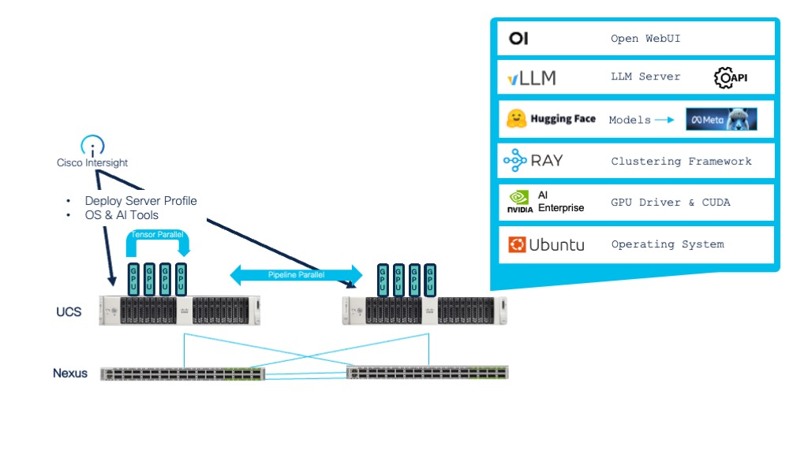
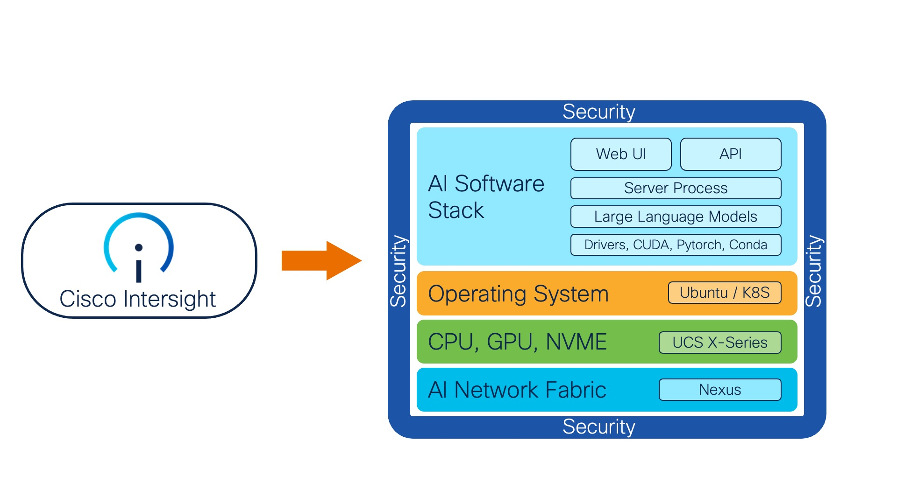

# AI Toolkit 2.0: Building Multi-host Distributed GPU Clusters on Cisco UCS and Nexus

On-prem AI models are often deployed on a single host with one or more GPU. This vastly limits the scale and size of the AI models being deployed. If your model is too large to fit in a single GPU, but it fits in a single node with multiple GPUs, you can use tensor parallelism. The tensor parallel size equals the number of GPUs you want to use. For example, if you have 2 GPUs in a single node, you can set the tensor parallel size to 2. But what if your model is too large to fit in a single node even if it has multiple GPUs? This problem can be solved with pipeline parallelism where you can leverage a high performance network in a multi-node multi-GPU cluster. In this case the tensor parallel size is the number of GPUs you want to use in each node, and the pipeline parallel size is the number of nodes you want to use. For example, if you have 8 GPUs in 2 nodes (4 GPUs per node), you can set the tensor parallel size to 4 and the pipeline parallel size to 2. Simply increase the number of nodes and GPU until you have enough memory to hold the model.



The purpose of the AI toolkit is to automate the full installation of the open source software tools needed to build a distributed AI cluster using either Cisco UCS X-Series or C-Series. The toolkit makes extensive use of the UCS X-fabric, PCIe node and GPU acceleration. You can use this toolkit to build a distributed multi-host cluster of GPUs that is shared across a network.

Generative AI is an exciting and emerging space. Running large language models (LLMs) in the cloud can be both costly and expose proprietary data in unexpected ways. These issues can be avoided by deploying your AI workload in a private data centre on a scalable cluster of modern compute infrastructure. 

### Table of Contents
1. [Overview](#overview)
2. [Installing the AI Toolkit](#installing-the-ai-toolkit)
3. [Running the vLLM server](#running-the-vllm-server)
4. [Performance Tuning](#performance-tuning)

## Overview

This solution guide will assist you with the full installation of:
1. Ubuntu linux operating system including various common utilities
2. GCC compiler required for development using the NVIDIA parallel computing and programming environment (CUDA)
3. NVIDIA GPU drivers as well as CUDA
4. Miniconda package, dependency and environment manager for python and C++. Miniconda is a minimal distribution of Anaconda that includes only conda, python, pip and some other useful packages. Very useful for data science as it includes a lot of dependencies in the package.
5. AI Monitor for monitoring CPU, network, memory, GPU and VRAM utilization on your system
6. Open WebUI user interface for testing large language models and performing Retrieval Augmented Generation (RAG)
7. Various LLMs such as Meta Llama and Microsoft Phi models. Many Llama 3 and Deepseek based models have been tested and work.
8. vLLM which is one of the fastest and easiest to use libraries for LLM inferencing and serving via an OpenAI compatible API
9. Ray Clusters which is a framework for developing and running parallel and distributed applications across hosts in AI
10. Docker container subsystem to allow you to run AI/ML containers
11. HuggingFace CLI utility to enable additional model download from Hugging Face



## Installing the AI Toolkit

### Pre-requisites

1. Cisco UCS X-series w/ X440p PCIe node and NVIDIA L4, L40, L40S, H100 GPU
2. Cisco Intersight account

### 1. Create Server Profile

In Intersight, derive and deploy a server-profile from a bare-metal linux template to a UCS X-Series X210c compute node. Basically all that is required is:
1. Boot from M.2 RAID
2. Single ethernet NIC with fabric failover (for redundancy)

### 2. Install OS on Server

From Intersight, select server and perform automated OS install. Use the custom OS install script from this repo called ```ucs-ai-toolkit.cfg``` for UCS X-series and UCS C-series. You will want to modify the cloud-init settings for: password, address, gateway4 and nameservers.

The following combination has been tested:
1. OS Image - ubuntu-22.04.2-live-server-amd64.iso as version Ubuntu Server 22.04 LTS
2. SCU Image - ucs-scu-6.3.2b.iso.iso as version 6.3.2b
3. OS Configuration File - ucs-ai-toolkit.cfg for X-Series and C-Series as version Ubuntu Server 22.04 LTS

Other combinations may work, but please try these before asking for assistance.


### 3. Install Additional Software

SSH into the server for the first time as username ubuntu and run the following commands (one-time):
```
wget https://raw.githubusercontent.com/pl247/ai-toolkit-2.0/main/ai-toolkit-install.sh
chmod a+x ai-toolkit-install.sh
./ai-toolkit-install.sh
```

YOU WILL NEED TO REBOOT to activate your NVIDIA GPU drivers.

```
sudo reboot
```

## Running the vLLM server

Now that the system is fully installed, you can run the vLLM server software.

Activate the vllm environment in conda, move to the correct directory and start the AI model in the vLLM server.

First try using a single GPU:
```
conda activate vllm
./1-GPU-vllm-start.sh
```

Now try two GPUs using tensor parallelism:
```
conda activate vllm
./2-GPU-vllm-start.sh
```

Finally try four (or more) GPUs using a combination of tensor and pipeline parallelism:
```
conda activate vllm
./8-GPU-vllm-start.sh
```


To access the application, open a web browser to your server IP address on port 7860.
http://10.0.0.10:7860

Monitor the system using the ai-monitor tool that was installed as part of the toolkit. Replace the IP address with the IP of your vllm server:
```
/ai/ai-monitor/ai-monitor-vllm.py --api-url http://10.1.1.11:8000/metrics
```

### Downloading Additional Models for vLLM

Check out the Hugging Face leader board: https://huggingface.co/spaces/HuggingFaceH4/open_llm_leaderboard and then download any of the models you would like to try using the following commands:

```
huggingface-cli download NousResearch/Meta-Llama-3-8B-Instruct --local-dir /ai/models/
```

Substitute <NousResearch/Meta-Llama-3-8B-Instruct> for any Hugging Face model you would like.


### Troubleshooting

If `wget` fails with the error message `unsafe legacy renegotiation disabled` try the following workaround:

```
sudo vi /usr/lib/ssl/openssl.cnf

#Add the following option to openssl.cnf under the [system_default_sect] section
Options = UnsafeLegacyRenegotiation
```

If you did not modify the timezone in the ```ucsx-ai-toolkit.cfg``` file, you can set the timezone on your system correctly post install:

```
# show current timezone with offset
date +"%Z %z"

# show timezone options for America
timedatectl list-timezones | grep America

# Set timezone
sudo timedatectl set-timezone America/Winnipeg
```

## Performance Tuning

One of the nice things about Cisco UCS and Intersight is the ability to create specific policies for your desired configurations. For generative AI workloads you may wish to create a BIOS policy for your servers with changes from the defaults as per the following document:

[Performance Tuning Guide](https://www.cisco.com/c/en/us/products/collateral/servers-unified-computing/ucs-b-series-blade-servers/performance-tuning-guide-ucs-m6-servers.html)

For faster boot times, create a BIOS profile with “Adaptive Memory Training” enabled. This setting is enabled under Server Management section.